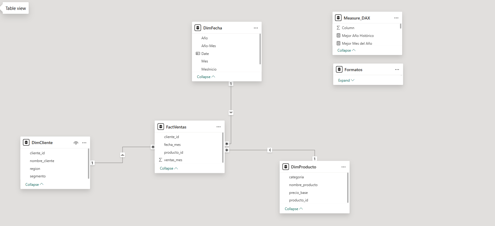
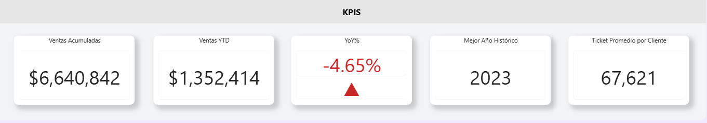
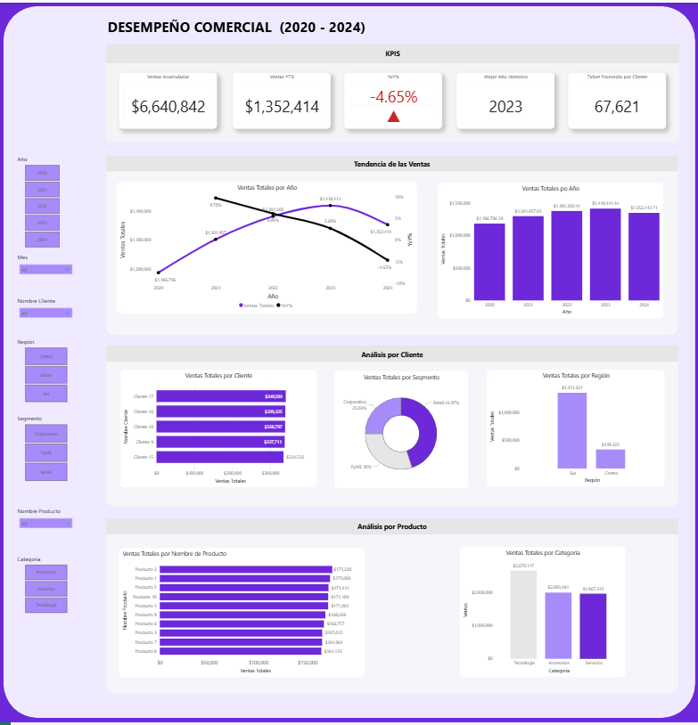

# Análisis Estratégico de Ventas – Modelo 5 Años

## Objetivo del Proyecto

Este dashboard analiza el desempeño comercial de una empresa durante un período de 5 años, permitiendo evaluar crecimiento, comportamiento de clientes y desempeño de productos.

El enfoque principal es identificar:
- Mejor año histórico
- Tendencia mensual
- Ticket promedio por cliente
- Segmentación comercial
- Concentración de ventas por producto y región

## Modelo de Datos

El modelo está construido bajo un esquema estrella:

- FactVentas (tabla de hechos)
- DimCliente
- DimProducto
- DimFecha

El diseño permite análisis dinámico por año, mes, cliente, segmento y categoría.

## KPIs Implementados

- Ventas Totales
- Variación YoY (%)
- Mejor Año Histórico
- Mejor Mes del Año
- Ticket Promedio por Cliente

## Funcionalidades

- Segmentadores dinámicos por Año y Mes
- Comparación interanual
- Análisis por Segmento de Cliente
- Análisis por Categoría de Producto
- Top Clientes
- Distribución por Región

## Principales Hallazgos

- 2023 fue el mejor año histórico en ventas.
- En 2024 se observa una contracción del -4.65% respecto al año anterior.
- La mayor concentración de ingresos proviene de un grupo reducido de clientes (Top 5).
- El segmento Corporativo presenta el ticket promedio más alto.

## Capturas del dashboard

