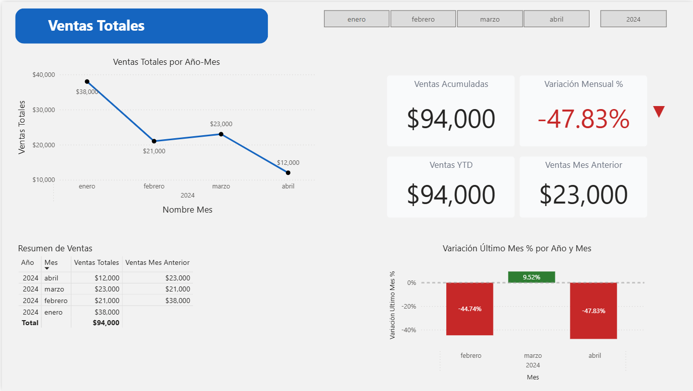
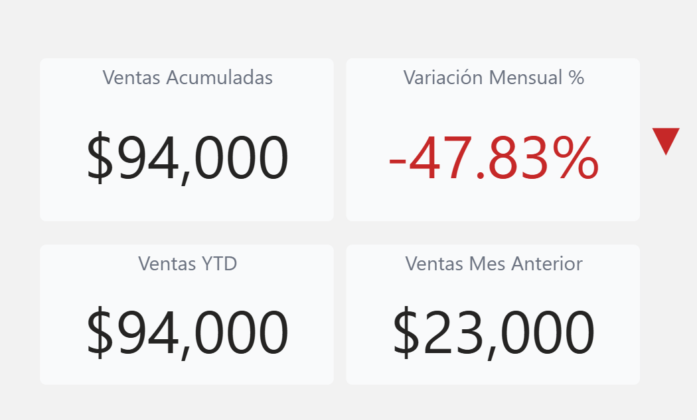

# dashboard-Desempeño_Comercial_PowerBI
powerbi  
business-intelligence  
sql  
dax  
dashboard  
analytics

# Dashboard  Desempeño Comercial (2020 - 2024) – Power BI

## Contexto del negocio

Este proyecto simula el análisis de ventas mensuales de una empresa con el objetivo de **monitorear el desempeño comercial**, identificar **variaciones mes contra mes** y ofrecer a la gerencia una visión clara y rápida del comportamiento de las ventas.

El dashboard está pensado para responder preguntas clave como:

* ¿Cuánto se ha vendido en el periodo seleccionado?
* ¿Cómo se comparan las ventas contra el mes anterior?
* ¿Existe crecimiento o caída en las ventas recientes?
* ¿Cuál es el acumulado del año (YTD)?

Este tipo de análisis es común en áreas de **Business Intelligence, Finanzas y FP&A**, donde se requiere información confiable para la toma de decisiones.

---

## Modelo de datos

El modelo se construyó siguiendo buenas prácticas de **modelo estrella**.

### Tablas principales

* **vw_ventas_mensuales (vista SQL)**

  * Contiene las ventas agregadas a nivel mensual.
  * Incluye métricas como ventas del mes y variación respecto al mes anterior.

* **DimFecha (tabla de fechas en DAX)**

  * Tabla calendario completa (2023–2025).
  * Permite análisis temporal, filtros por año y mes, y cálculos de inteligencia de tiempo.

### Relación

* `vw_ventas_mensuales[fecha_mes]` → `DimFecha[Date]`
* Relación **1 a muchos**, con `DimFecha` como tabla de fechas marcada en Power BI.

Este diseño garantiza:

* Correcto manejo de contexto de fechas.
* Escalabilidad a múltiples años.
* Compatibilidad con funciones de time intelligence.

---

## Medidas clave (DAX)

### Ventas Totales

Suma de las ventas del periodo según el contexto de filtros.

```DAX
Ventas Totales =
SUM('vw_ventas_mensuales'[ventas_mes])
```

---

### Ventas Mes Anterior

Obtiene las ventas del mes inmediatamente anterior al mes seleccionado.

```DAX
Ventas Mes Anterior =
CALCULATE(
    [Ventas Totales],
    DATEADD(DimFecha[Date], -1, MONTH)
)
```

> Nota: Para el primer mes disponible, el resultado puede ser BLANK, ya que no existe un mes previo para comparar.

---

### Variación Último Mes (%)

Calcula el cambio porcentual respecto al mes anterior.

```DAX
Variación Último Mes % = 
VAR Actual = [Ventas Totales]
VAR Anterior = [Ventas Mes Anterior]
VAR Variacion =
DIVIDE(Actual - Anterior,
Anterior)
RETURN
IF(Variacion,Variacion,0)
```

Esta medida permite identificar rápidamente **crecimientos o caídas relevantes**.

---

### Ventas YTD (Year to Date)

Calcula las ventas acumuladas desde el inicio del año hasta el último mes disponible en el contexto.

```DAX
Ventas YTD =
TOTALYTD(
    [Ventas Totales],
    DimFecha[Date]
)
```

---

##  Decisiones técnicas relevantes

*  Se utilizó una **vista SQL** para preparar los datos mensuales y reducir carga en Power BI.
*  La **tabla de fechas** se generó en DAX para mantener control total del calendario.
*  Se priorizó el uso de **DATEADD y TOTALYTD** en lugar de lógica manual.
*  En tarjetas, se evitó mostrar valores inconsistentes y se controlaron escenarios sin mes previo.
*  El modelo está preparado para escalar a más años sin modificar medidas.

---

## Diseño del dashboard

Principios aplicados:

* Diseño limpio y profesional.
* Paleta de colores sobria (azul para métricas principales, rojo/verde para variaciones).
* Jerarquía visual clara: KPIs → tendencias → detalle.
* Uso de tarjetas para KPIs clave y gráficos para análisis temporal.

### Visuales incluidos

* Tarjetas KPI: Ventas Totales, Ventas YTD, Ventas Mes Anterior, Variación Último Mes.
* Gráfico de líneas: evolución de ventas por mes.
* Gráfico de columnas: variación porcentual mensual.
* Tabla resumen con detalle por año y mes.

---

##  Capturas del reporte

## Capturas del dashboard




El dashboard incluye cuatro KPIs clave para el análisis ejecutivo:

- **Ventas Totales**: ventas del periodo seleccionado.
- **Ventas YTD**: acumulado anual.
- **Ventas Mes Anterior**: referencia para comparación temporal.
- **Variación Mensual (%)**: cambio porcentual vs mes anterior.


##  Insights que puede obtener el negocio

A partir de este dashboard, el negocio puede:

* Detectar **caídas fuertes de ventas** mes contra mes.
* Identificar meses con **crecimiento positivo**.
* Evaluar el desempeño acumulado del año.
* Tomar decisiones informadas sobre ajustes comerciales o presupuestales.

---

## Posibles mejoras futuras

* Análisis por producto o categoría.
* Comparativo Año contra Año (YoY).
* Segmentación por región o canal.
* Metas y variación contra objetivo.
* Publicación en Power BI Service con actualización automática.

---

## 👤 Autor

**Whendy Yohaly Ocampo Mejía**
Analista de Datos / Business Intelligence
Proyecto realizado como parte de un portafolio profesional en Power BI.
